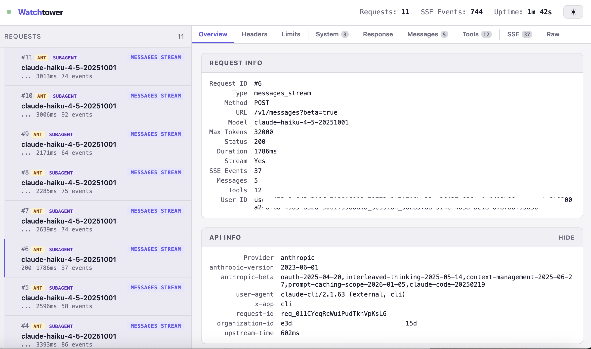

# Watchtower

Monitor, inspect, and debug all API traffic between AI coding agents and their APIs — with a real-time web dashboard.

> Like Chrome DevTools Network tab, but for Claude Code and Codex CLI.

<!-- TODO: Add screenshot of dashboard here -->
<!--  -->

## Why

AI coding agents make dozens of API calls per interaction — streaming messages, token counts, quota checks, subagent spawns — and you can't see any of it. Watchtower sits between your AI agent and its API, captures everything, and gives you a live dashboard to inspect it all.

**Works with:**
- [Claude Code](https://docs.anthropic.com/en/docs/claude-code) (Anthropic)
- [Codex CLI](https://github.com/openai/codex) (OpenAI)
- Any OpenAI-compatible client

**What you see:**

- Every request and response, fully decoded
- SSE stream events in real time
- Agent hierarchy tracking (main agent → subagents → utility calls)
- Token usage, rate limits, and timing
- System prompts, tool definitions, full message history
- Dark and light mode
- All logged to disk as JSON for later analysis

## Quick Start

```bash
npm install -g watchtower-ai
watchtower-ai
```

Or clone and run directly:

```bash
git clone https://github.com/fahd09/watchtower.git
cd watchtower
npm install
npm start
```

Then point your AI agent at the proxy:

```bash
# Claude Code
ANTHROPIC_BASE_URL=http://localhost:8024 claude

# Codex CLI
OPENAI_BASE_URL=http://localhost:8024 codex
```

Open **http://localhost:8025** — that's it. Both providers share the same proxy port. Requests are auto-detected.

## Usage

```bash
# Default ports: proxy=8024, dashboard=8025
node intercept.mjs

# Custom ports
node intercept.mjs 9000 9001
```

### Dashboard Tabs

| Tab | What it shows |
|-----|--------------|
| **Overview** | Duration, model, status, token counts, rate limits |
| **Messages** | Full conversation history (user/assistant messages) |
| **Response** | Pretty-printed response JSON |
| **Tools** | Tool definitions with searchable parameters and schemas |
| **Stream** | Raw SSE events with expandable payloads |
| **Headers** | Request and response headers |
| **Rate Limits** | Rate limit headers with visual progress bars |
| **Raw** | Complete request/response bodies as JSON |

### Request Classification

The proxy automatically classifies each request:

**Anthropic:**
- `messages_stream` — Streaming chat (the main interaction)
- `messages` — Non-streaming chat
- `token_count` — Token counting
- `quota_check` — Quota/permission check (`max_tokens=1`)

**OpenAI:**
- `responses_stream` / `responses` — Responses API (Codex CLI default)
- `chat_stream` / `chat_completion` — Chat Completions API
- `models` — Model listing
- `embeddings` — Embedding requests

### Agent Roles

Each request is tagged with an agent role:

- **main** — The primary agent (Claude Code's main agent has the `Agent` tool; Codex requests with tools)
- **subagent** — A spawned sub-agent (Explore, Plan, etc.)
- **utility** — Token counts, quota checks, and tool-less calls

### Logs

All requests are saved to `./logs/` as numbered JSON files:

```
logs/0001_messages_stream_claude-opus-4-6.json
logs/0002_token_count_claude-haiku-4-5-20251001.json
```

Each file contains the complete request/response cycle: headers, body, SSE events, timing, and rate limits.

## How It Works

```
Claude Code  ──HTTP──┐
                     ├──>  Watchtower (proxy)  ──HTTPS──>  api.anthropic.com
Codex CLI    ──HTTP──┘          │              ──HTTPS──>  api.openai.com / chatgpt.com
                                │
                                ├── logs to disk
                                ├── broadcasts via WebSocket
                                │
                          Dashboard (web UI)
```

1. Your AI agent sends requests to the local proxy instead of directly to the API
2. Watchtower auto-detects the provider and forwards to the correct upstream
3. Responses (including SSE streams) are decoded, logged, and forwarded back
4. The dashboard connects via WebSocket for real-time updates

## Requirements

- Node.js >= 18

## Roadmap

See [TODO.md](TODO.md) for the full roadmap, including planned features like:

- Cost & token tracking
- Search & filter
- System prompt diffing
- Request replay & modification (Burp Suite for Claude)
- Agent hierarchy tree visualization

## Contributing

Contributions welcome. Open an issue first for anything non-trivial.

```bash
git clone https://github.com/fahd09/watchtower.git
cd watchtower
npm install
npm start
```

The proxy is in `intercept.mjs`, provider logic in `providers/`, and the dashboard is a single `dashboard.html`. No build step, no bundler.

## License

[MIT](LICENSE)
